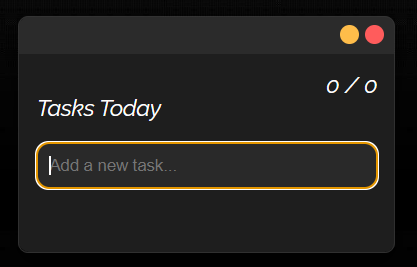

# Macro App

## Description

The **Macro Task  App** is a lightweight and efficient task management tool built using Electron, React, and JavaScript. Designed with a sleek and minimalistic UI, this app allows users to manage their daily tasks seamlessly while leveraging desktop integration features. Whether you’re keeping track of personal goals or managing work priorities, the Macro Task  App provides a distraction-free, always-on-top task management experience.

---

## Features

### Core Features

- **Add New Tasks**:
  - Enter task titles with a maximum limit of 100 characters.
  - Tasks are automatically sorted into incomplete and completed categories.

- **Mark Tasks as Complete**:
  - Quickly toggle a task’s status to mark it as completed.
  - Completed tasks automatically move to the bottom of the list with a strikethrough style.

- **Delete Tasks**:
  - Remove tasks effortlessly with a single click.

- **Reorder Tasks**:
  - Drag and drop incomplete tasks to rearrange them according to your priorities.

---

### User Interface Features

- **Always-On-Top Mode**:
  - The app stays visible over other windows for quick access.

- **Resizable Window**:
  - Adjust the app's size based on your preferences or workflow needs.

- **Minimalistic Design**:
  - A clean and distraction-free user interface with dark mode aesthetics.

- **Auto-Adjusting Height**:
  - The app dynamically resizes its height based on the number of tasks.

---

### Desktop Integration Features

- **Start on System Boot**:
  - Option to start the app automatically when the system boots up.

- **System Tray Integration**:
  - Minimize the app to the system tray for quick access.

- **Keyboard Shortcuts**:
  - Use `Enter` to add tasks and quickly manage them.

- **Opacity Management**:
  - Automatically reduces opacity after 1 second of inactivity to save screen space.
  - Opacity resets to 100% when the cursor re-enters the app or when typing in the input field.

---

### Customization Options

- **Drag-and-Drop Sorting**:
  - Reorder incomplete tasks using drag-and-drop functionality.

- **Completed Task Styles**:
  - Completed tasks appear with reduced opacity and a strikethrough for better visual distinction.

- **Adaptive Word Wrapping**:
  - Long task descriptions break into multiple lines to prevent horizontal scrolling.

---

### Technical Features

- Built with **Electron** for cross-platform compatibility.
- Uses **React** for efficient UI rendering.
- Stores user tasks locally using **Electron Store** for data persistence.
- Fully packaged as a `.exe` installer for Windows.

---

## Installation

1. Clone the repository:
   ```bash
   git clone https://github.com/your-repo/todo-app.git
   cd todo-app
   ```

2. Install dependencies:
   ```bash
   npm install
   ```

3. Run the app:
   ```bash
   npm start
   ```

4. Build the app into a `.exe` file (Windows):
   ```bash
   npm run build
   ```
   The executable will be available in the `dist` folder.

---

## Usage Instructions

1. Open the app and start adding tasks.
2. Use the input box to type a new task and press `Enter` to add it.
3. Drag and drop incomplete tasks to rearrange their order.
4. Mark tasks as complete by clicking the circle on the left of each task.
5. Delete tasks by clicking the delete button on the right.
6. Minimize the app to the system tray for quick access.

---

## Technologies Used

- **Electron**: For building cross-platform desktop apps.
- **React**: For creating dynamic and interactive UI components.
- **JavaScript**: Core language for app logic and functionality.
- **Electron Store**: For local data persistence.

---

## Screenshots


---

## Author

Developed by Tanishk Pandey. For questions or feedback, please email pandeytanishk@gmail.com.

